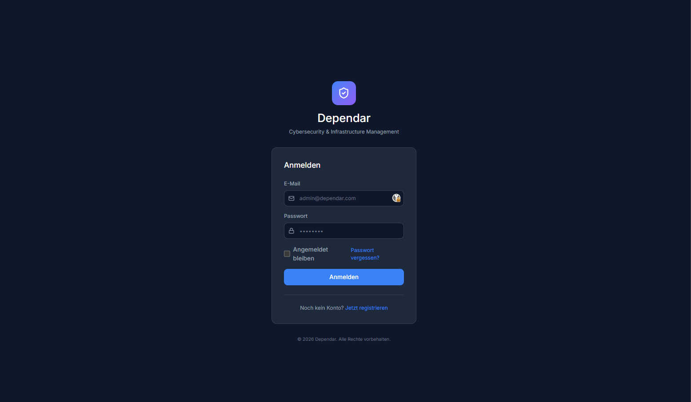
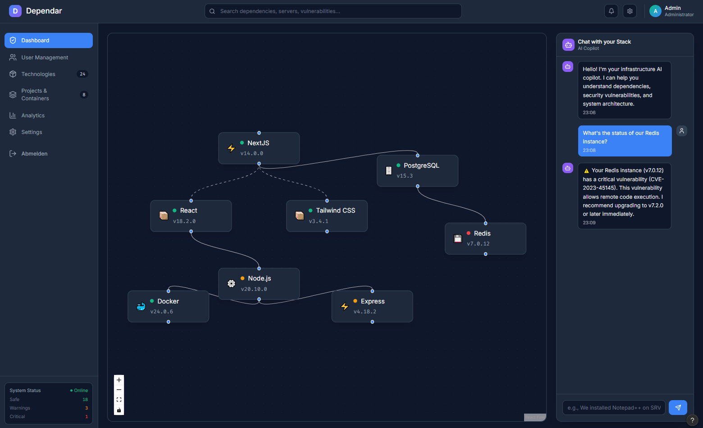
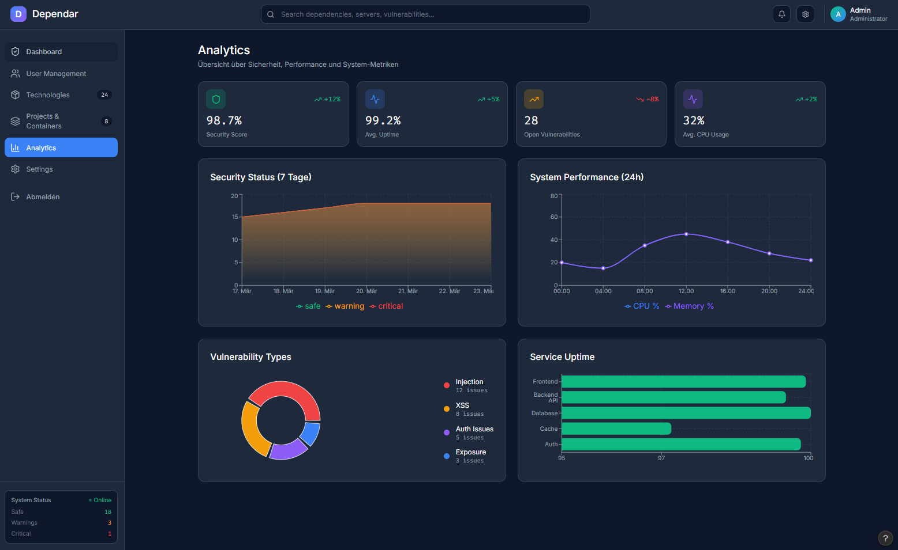
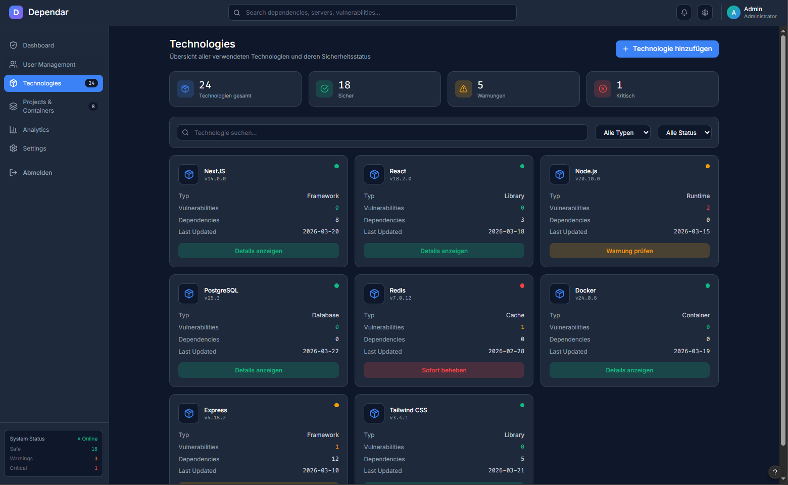
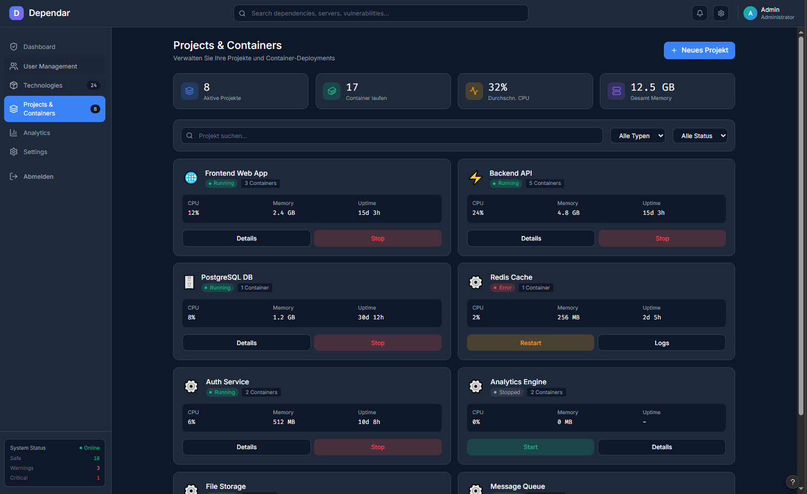
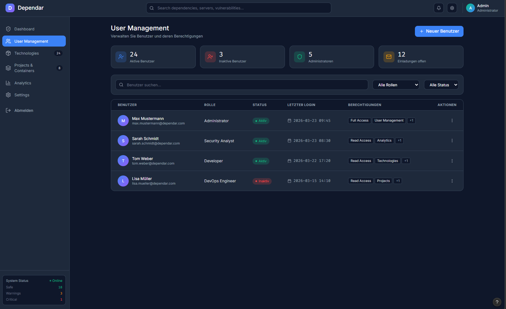
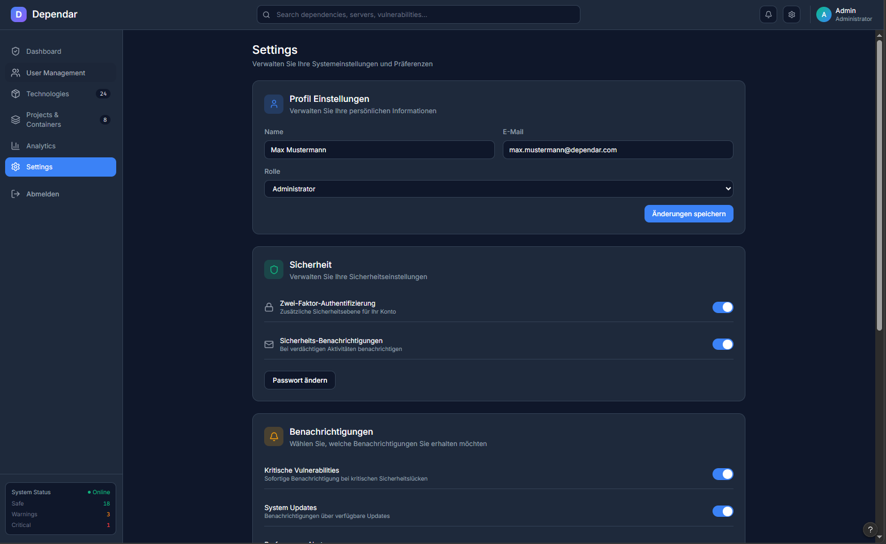

# 🎨 Dependar: UI Showcase

This document provides a visual overview of the Dependar user interface. The design is based on our High-Contrast Dark Mode Theme (Slate) and is optimized for maximum clarity when managing complex infrastructures and security alerts.

---

## 1. Authentication (Login)
A clean, secure entry point into the system, protected by our JWT-based authentication.

---

## 2. Dashboard: Interactive Dependency Graph & AI Copilot
The heart of Dependar. Here, the entire infrastructure is visualized as an interactive graph (`React Flow`). On the right side is the integrated Ollama AI Copilot for auto-triage and context-aware chat inputs.

---

## 3. Analytics & Security Posture
Comprehensive metrics on system health, performance, and security. Here, CVEs are categorized and historical security trends of recent days are visualized.

---

## 4. Technologies
A normalized view of all technologies (frameworks, databases, runtimes) discovered in the network. Instantly shows how many containers use a specific technology and whether critical vulnerabilities exist.

---

## 5. Projects & Containers
The operational view of running containers and projects. Offers real-time metrics (CPU, RAM, Uptime) and quick actions to start/stop services.

---

## 6. User Management
Lightweight, role-based access control (RBAC). Here, administrators manage access to the Dependar system.

---

## 7. Settings
Global configurations, profile settings, notification preferences, and security options (like Two-Factor Authentication).

